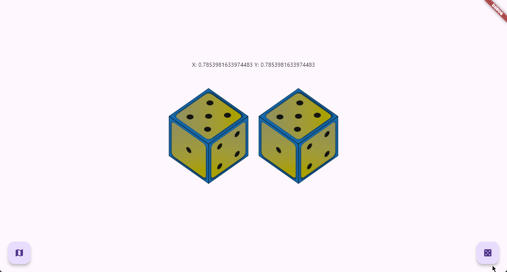

# 🎲 Flutter DiceRoller

A 3D animated dice simulator built with Flutter. This app renders two interactive dice that can be rotated via touch or rolled with a smooth animation. Each die face is textured using custom assets and responds realistically to user input.

 <!-- optional: add preview.gif or screenshot -->

---

## ✨ Features

- 🎲 Two fully animated 3D dice
- 🔄 Touch & drag to rotate in real-time
- 🎰 "Roll Dice" button with elastic 3D animation
- 🖼️ Customizable dice skins via asset images
- 🧮 Realistic face visibility based on rotation matrix
- 🧊 Matrix transformations and 3D vector math using `vector_math`

---

## 📦 Installation

1. Clone the repository:
   ```bash
   git clone https://github.com/your-username/flutter_diceroller.git
   cd flutter_diceroller
